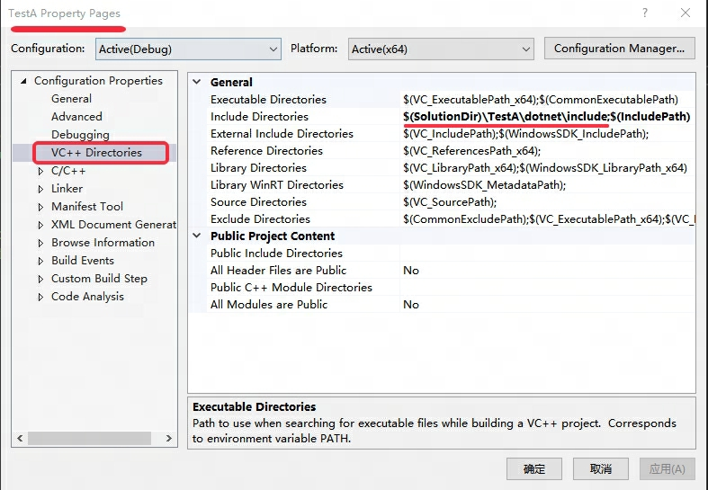

# 目录

- [步骤](#步骤)
    - [创建一个C++控制台工程](#创建一个C++控制台工程)
    - [拷贝核心头文件](#拷贝核心头文件)
    - [配置IncludeDir](#配置includedir)
- [参考文档](#参考文档)
## 步骤

### 创建一个C++控制台工程

### 拷贝核心头文件

拷贝核心头文件到项目目录下

- 拷贝路径
    - [dotnet/runtime](https://github.com/dotnet/runtime)仓库目录下的`src\native\corehost`

- 需要拷贝的文件
    - coreclr_delegates.h
    - hostfxr.h

- 以当前项目(TestA)为例，拷贝到`{sln dir}/TestA/dotnet/include/`目录下

### 配置IncludeDir

- 目的：使得在工程中能直接include coreclr的 [核心的头文件](#拷贝核心头文件)
- 设置TestA.vcxproj的属性，如下图所示：

## 参考文档

- https://zhuanlan.zhihu.com/p/415875455
- https://learn.microsoft.com/en-us/dotnet/core/tutorials/netcore-hosting
- https://github.com/dotnet/samples/tree/main/core/hosting/src